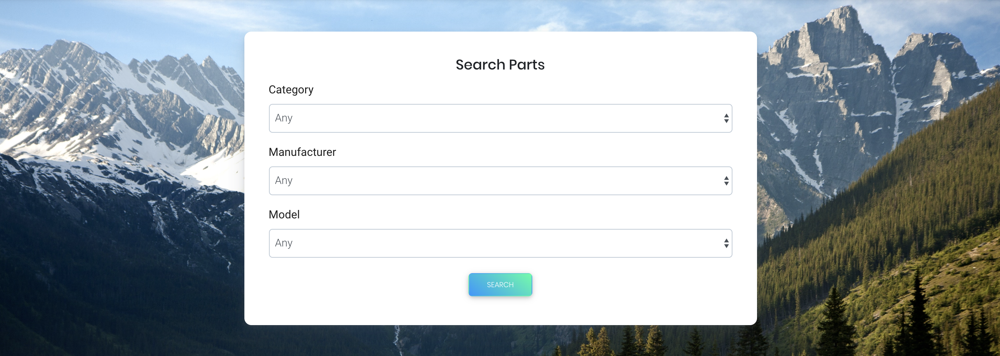

# React-Parts

Before starting a huge $2m project with Daimler/ Mercedes, developed this quick React proof of concept to exemplify the speed, quality, and effectiveness that will be implemented along with the benefits of the current #1 frontend technology in the world. Mainly to give a quick/ functioning visual and of course because its fun :) 

Each piece of this application is broken down into separate components (Navbar, carousel, PartCards, Search Form, Confirmation Modal, Footer, etc)

## Technologies Used:
____
* HTML, JSX, CSS, SCSS, JavaScript, React-Bootstrap, React.js, Styled Components, React-Animations, Node.js, Express.js, AWS

## Quick Site Glance
___

